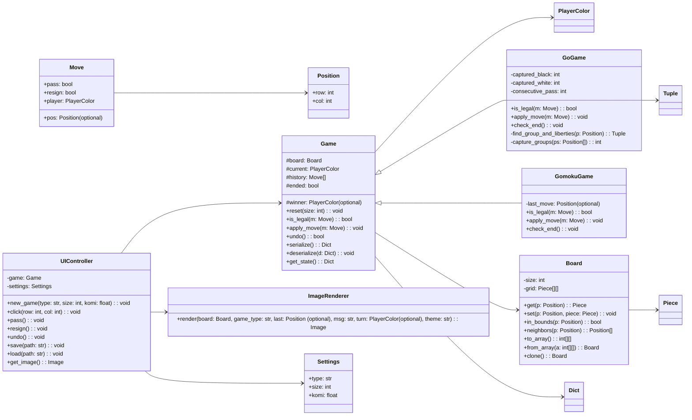

# 棋类对战平台（第一阶段）

作者：陈骁

仓库：[GitHub链接](https://github.com/Cevaaa/go.git)

## 1. 目标与范围
实现一个通用的棋类对战平台，第一阶段包含五子棋与围棋的本地双人对战：
- 五子棋：任一方连成五子即胜，满盘和棋
- 围棋：支持提子、禁入点（无气点禁止）、虚着；终局通过双方连续虚着判定，简单中国数地法计算胜负（地盘 + 提子数 + 贴目）
- 通用能力：悔棋、认负、保存/读取局面、重新开始、设置棋盘大小（8~19）

UI 使用 Gradio，点击棋盘落子，美观、响应式。后端与 UI 分离，便于未来扩展更多棋种或接入其他客户端（CLI/GUI）。

## 2. 架构与设计

### 2.1 分层架构
- core/ 基础抽象与工具
  - board.py：棋盘与位置表示、序列化
  - rules.py：规则接口与共性算法（如连线检测、气与提子）
  - game.py：Game 模板与通用回放/悔棋/保存/读取
  - gomoku.py：五子棋实现（继承 Game，使用连线检测策略）
  - go.py：围棋实现（继承 Game，使用气与提子策略）
  - models.py：枚举、异常、数据模型
- ui/ gradio 客户端
  - app_ui.py：UI 控制器，事件绑定、画布绘制、布局
- app.py：入口
- docs/ README.md、UML 图

### 2.2 关键类与职责
- Position(row, col)：不可变坐标值对象
- Board(size)：网格与棋子持有者，提供 get/set、邻接、遍历、序列化
- PlayerColor(Enum)：BLACK/WHITE；Piece(Enum)：空/黑/白
- Move：落子或特殊动作（虚着、认负）
- Game（抽象）：维护棋盘、当前手、历史、终局状态、保存/读取、模板方法驱动一步走子
- GomokuGame：实现 is_legal、apply_move、check_end、winner 判定
- GoGame：实现合法性（自杀禁手、打劫简单处理可选）、提子逻辑、虚着、终局与数地
- Rule helpers：is_five_in_a_row、find_group_and_liberties、capture_groups
- GameSerializer：将游戏状态保存/读取 JSON（包含棋种、棋盘、历史、当前手）
- UIController：与后端交互，绘图与交互状态（如选择棋种、棋盘大小）
- ImageRenderer：用 PIL 绘制棋盘为图像（避免外部图片 URL）

设计模式体现：
- 模板方法：Game 定义通用对局流程，具体规则由子类实现
- 策略/职责分离：规则相关算法封装在 rules 工具中；渲染由 ImageRenderer 独立于业务逻辑
- 命令与可回放：每一步为 Move 记录，支持悔棋（回退状态）
- 工厂方法：通过 create_game 根据类型创建不同游戏实例
- MVC-ish：Model（core.*）与 View/Controller（ui.*）分离

### 2.3 异常与不合法处理
- 棋盘越界、落子到非空位、围棋自杀点、读取存档不合法、棋盘大小越界、正在对局中切换设置等，均抛出或返回错误消息，UI 统一反馈。

### 2.4 数据持久化
- JSON 存档：包含 game_type、board_size、board数组、current_player、move_history、captured_counts、aux（围棋虚着连续次数字段）等。
- 通过 UI「保存」「读取」按钮操作。

### 2.5 测试用例建议
- 五子棋：水平/垂直/斜线成五
- 围棋：提子（打吃后收气）、自杀禁手、虚着-虚着-终局
- 保存后读取一致性

## 3. UML

## 4. 终局与判定

- 五子棋：每步后检查八方向是否有连续 >= 5
- 围棋：
  - 合法性：禁止自杀（落子后若己方棋链无气且未提对方则非法）
  - 提子：对落子点相邻之对方无气棋链提走
  - 虚着：记录 consecutive_pass，若双方连续虚着达到 2，则进入结算
  - 计分：数地 = 空点完全被某一方围住的点数；总分 = 地 + 提子数 + 贴目（白贴目，默认 7.5，可在 UI 设置）
  - 简化：不实现复杂打劫复现判断（Ko），教学向满足课程第一阶段

## 5. 可扩展性
- 新增棋种：继承 Game，复用 Board、Move、渲染器、UI；仅需覆写规则相关方法
- 多人/人机：增加 Player 抽象与 AI 策略接口
- 多客户端：CLI/桌面 GUI 仅需替换 UI 层

## 6. 运行与打包
- 依赖：gradio, pillow
- 运行：python app.py
- 浏览器：自动打开本地地址