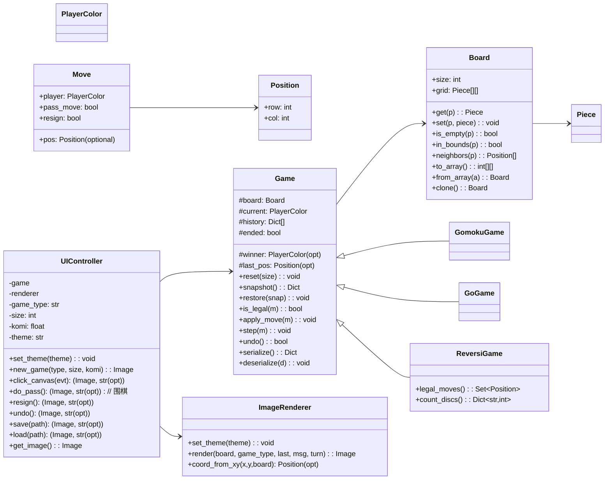

# 棋类对战平台（第二阶段：新增黑白棋 Reversi/Othello）

## 1. 目标与范围

在第一阶段（五子棋、围棋）基础上，新增黑白棋（Reversi/Othello）对战功能，遵循既有的分层架构与面向对象设计，保持良好的可扩展性与复用性，不破坏已实现特性（悔棋、认负、保存/读取、虚着仅限围棋、主题、移动端布局等）。

本阶段交付：
- 新增 Reversi 游戏类型，默认 8×8（推荐偶数盘）。
- 支持合法落子判断、翻子、强制跳过（无合法着法时）。
- 终局：棋盘填满或双方均无合法着法时，比较子数判胜负。
- UI 无缝集成，存档/读档与前两种棋类一致，兼容旧存档。

## 2. 架构与设计

### 2.1 分层架构（延续）
- core/ 基础与棋规
  - board.py：网格/位置/邻接/序列化
  - rules.py：通用规则算法（五连、气与提子等）
  - game.py：抽象模板（历史快照、悔棋、通用序列化）
  - gomoku.py / go.py：既有棋种实现
  - reversi.py：新增黑白棋实现（本次新增）
  - factory.py：工厂方法扩展，统一规范类型标识
- ui/
  - renderer.py：PIL 渲染（英文文字），复用圆子绘制，支持不同棋种的视觉差异
  - controller.py：UI 控制器（按钮与事件逻辑），扩展对 Reversi 的处理（跳过回合、终局判定、保存/读取）
  - app_ui.py：Gradio UI，两列布局、右侧 Accordion 可隐藏、移动端响应式
- app.py：入口

### 2.2 设计模式与原则

- 工厂方法（Factory Method）：`create_game(game_type, size, komi)` 新增对 `'reversi'/'黑白棋'/'othello'` 的支持；通过 `normalize_game_type` 统一规范化标识，避免类型歧义。
- 模板方法（Template Method）：`Game.step` 统一走子流程（合法性检查、历史快照、应用走子），各子类实现 `is_legal/apply_move`；黑白棋仅覆写规则相关方法，复用悔棋/历史/序列化。
- 职责分离/策略：棋规在 core 子类内，渲染在 `ImageRenderer`，控制器与 UI 仅作胶水，不侵入业务逻辑。
- 开闭原则：新增棋种无需修改已有类的内部逻辑，主要在工厂与控制器的小范围扩展，UI 添加一个单选项，原功能不受影响。
- 接口隔离：UIController 暴露统一的命令接口（click/pass/resign/undo/save/load/new_game），三种游戏共享调用方式，降低耦合。
- 可维护性与兼容：保存/读取沿用第二/第三阶段的规范（`meta.type` 仅写 `'go'/'gomoku'/'reversi'`），加载时兼容中文、类名、旧字段回退。

## 3. 黑白棋规则建模

- 棋盘：默认 8×8，初始布局（中心 4 子）：d4/e5 为黑，d5/e4 为白（或等价坐标，以下实现用 0 索引中心格）。
- 行棋：轮到一方时，必须在某个空位落子，且至少在 8 个方向之一“夹住”对手棋子（即自子—若干对方子—自子形成直线），所有被夹住的对方子翻转为己方。
- 如果当前一方没有合法着法，必须“跳过”一回合（pass-like 机制但仅黑白棋自动/手动触发，不改变规则设定）。
- 终局：棋盘填满或双方连续均无合法着法，计数己方与对方棋子数，子数多者胜；相等为平局。
- 认负：与其他棋种一致，可随时认负，直接结束。
- 悔棋：沿用 `Game` 级历史快照回退。

实现要点：
- 计算合法点：对全部空位，检查 8 方向上是否存在“至少一段连续对方子，末端为己方子”的连线。
- 应用落子：翻转所有满足条件方向上的对方子，更新当前手。
- 无合法手处理：在 `UIController.click_canvas` 中，当检测到无合法手且用户点击任意位置，给出中文提示；提供“跳过一回合”逻辑，与 Reversi 的强制跳过规则匹配（区别于围棋“虚着”，该跳过无计分语义，仅让行）。

## 4. 关键类与函数

### 4.1 core.reversi.ReversiGame
- is_legal(move: Move) -> bool
  - 允许 resign，禁止 pass_move（黑白棋无“虚着”，但允许强制跳过由控制器判断并切手）
  - 对 pos 进行 8 方向合法性检测：至少一个方向“可翻转”即合法。
- apply_move(move: Move)
  - resign 直接结束并判对方胜。
  - 下子并翻转所有满足条件方向。
  - 若翻转数为 0（理论不应出现，is_legal 已保证），则抛 GameError。
  - 切换当前手。
- legal_moves() -> Set[Position]
  - 返回当前局面的全部合法落子集合。
- count_discs() -> Dict[str,int]
  - 统计双方棋子数，用于终局结算。
- serialize/deserialize
  - 继承父类基础字段，额外无需新增字段。

### 4.2 core.factory.normalize_game_type / create_game
- 新增 'reversi'/'黑白棋'/'othello'/'reversigame' 的规范映射。
- create_game 支持创建 ReversiGame，komi 参数对 Reversi 忽略。

### 4.3 ui.controller.UIController（扩展）
- 新增针对 Reversi 的“无合法着法时提示与强制跳过”流程：
  - 当轮到一方且 legal_moves 为空：
    - 直接切换当前手，并发送中文提示“当前无合法着法，自动跳过一回合。”
    - 若切换后对方仍无合法着法，则对局结束并按棋子数判胜平。
- click_canvas
  - 对 Reversi：若点击非合法点给出中文提示；合法则落子、翻子，判终局。
- _ended_popup
  - 对 Reversi：按棋子数判定胜负中文提示。
- save/load
  - 保存 meta.type 写标准英文 'reversi'；加载优先 meta.type，兼容中文/类名/早期字段。

### 4.4 ui.renderer.ImageRenderer（小幅增强）
- 继续用圆形黑白子渲染，底部英文说明；不引入外部图片资源。
- 对 Reversi 不绘制围棋星位。
- 保持接口不变，复用现有渲染路径。

## 5. UML（Mermaid）

## 6. 测试用例（示例）

- Reversi 合法性检测：
  - 初始 8×8 局面，黑先，合法点应为 4 个（中心 4 邻接位置）。点击除此 4 点之外位置，提示“非法落子”。
- 翻子规则：
  - 在初始局面，黑在 (2,3) 落子（以 0 为索引），应翻转一条或多条连续的白子，数量与方向符合规则。
- 强制跳过：
  - 构造局面使当前方无合法着法，控制器自动切手并提示“当前无合法着法，自动跳过一回合。”
- 终局计数：
  - 填满棋盘或双方连续无合法着法，系统统计黑白子数，胜负或平局与手工计数一致。
- 兼容性：
  - 保存 Reversi 存档，读取后保持棋种与局面一致。
  - 读取旧存档（中文或类名）仍能正常解析围棋/五子棋。

## 7. 运行与依赖
- 依赖：`pip install gradio==4.* pillow`
- 运行：`python app.py`
- 浏览器打开自动弹出的本地地址
- 建议在桌面与移动端均测试 UI 折叠侧边栏与响应式布局

## 8. 设计原则体现与总结
- 新棋种完全复用框架能力（悔棋、序列化、统一渲染、统一事件），仅在 `ReversiGame` 内实现规则核心，表现开闭原则。
- 通过 `normalize_game_type` 统一类型标识，避免多语言/类名带来的歧义，提升工程健壮性。
- UI 在不破坏既有交互的前提下扩展，按钮与事件绑定保持一致，降低学习成本与维护成本。