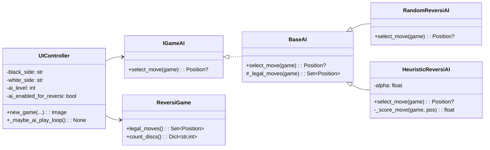

# 棋类对战平台（第二阶段：AI 扩展）

本阶段在已实现的五子棋、围棋、黑白棋基础上，完成 AI 对手的设计与实现，支持 玩家-玩家 / 玩家-AI / AI-AI 三种对战模式。重点实现黑白棋的两级 AI：随机合法落子的一级AI与启发式评估的二级AI（可稳定战胜一级AI）。

## 1. 目标与范围

- 新增 AI 框架与接口，遵循面向对象设计原则，便于后续扩展更多棋种与更强AI。
- 实现黑白棋 Reversi 的两级AI：
  - Level 1（Random）：从合法着法中等概率选取。
  - Level 2（Heuristic）：基于稳定度与位置价值（角、边、内层）及翻子收益的启发式函数，能稳定战胜随机AI。
- 支持模式：
  - 玩家-玩家：与第一阶段一致。
  - 玩家-AI：用户选择黑方/白方为玩家，其它一方由AI控制。
  - AI-AI：用于演示/测试，双方均由AI自动落子。
- UI 集成：右侧设置栏可选择“对手类型（黑/白）”“AI 类型（黑白棋）”“AI 级别（1/2）”；保持响应式与可折叠。

说明：当前版本的 AI 仅在黑白棋下工作。若选择围棋/五子棋且打开 AI 模式，系统会提示“当前棋种暂不支持AI，已改为玩家对战”。

## 2. 架构与设计

### 2.1 分层与模块
- core/
  - ai/base.py：AI 接口 IGameAI 与抽象基类 BaseAI（约定 select_move 接口）
  - ai/random_ai.py：随机合法着法 AI（Reversi）
  - ai/reversi_rule_ai.py：启发式 Reversi AI
  - reversi.py：黑白棋规则实现（提供 legal_moves、count_discs 等供AI评估）
  - go.py / gomoku.py / factory.py / models.py / game.py / board.py：与第一阶段一致（factory 含 normalize）
- ui/
  - controller.py：管理玩家/AI 回合、事件驱动、存读盘
  - renderer.py：渲染棋盘
  - app_ui.py：Gradio UI，新增选择项
- app.py：入口不变

### 2.2 设计模式
- 策略模式（Strategy）：不同 AI 算法实现同一接口 IGameAI（select_move），在运行时可切换（Random vs Heuristic）。
- 工厂方法（Factory）：利用已有 create_game 创建不同棋种；AI 选择在 UIController 中按类型组装（也可后续抽象 AI 工厂）。
- 模板方法（Template）：Game.step 模板负责合法性校验、历史快照、执行；AI 仅提供“选点策略”。
- 单一职责：AI 模块只负责决策；棋规在 core.{reversi,go,gomoku}，UI 控制在 controller；渲染在 renderer。
- 开闭原则：新增 AI 算法无需改动既有规则与渲染；新增棋种 AI 仅需新增对应实现并在控制器注入。

### 2.3 面向对象原则体现
- 封装：AI 仅通过公开方法读取游戏状态（Board、current、legal_moves），屏蔽内部细节。
- 多态：不同 AI（Random/Heuristic）对同一接口提供不同实现，控制器不区分具体类型。
- 依赖倒置：UIController 依赖抽象（IGameAI）而非具体实现。

## 3. 黑白棋二级AI的启发式设计

启发式评分函数核心要点：
- 位置权重：corner >> edge >> inner，角点（四角）非常有利；避免给对手送出可抢角的机会。
- 稳定性近似：靠近角的边格若能形成稳定连线优先；简化实现通过静态权重矩阵体现。
- 翻子收益：优先能翻更多对手子的着法，但不凌驾于角点优势之上。
- 回合意义：以当前玩家视角评分，计算 move 后的即时局面得分，不进行深度搜索（保持实现简单、可解释）。

本工程使用一个经典 8×8 静态权重矩阵（可扩展到更大偶数盘，非8×8时则使用缩放/边界权重近似），并折中考虑翻子数量。足以稳定战胜纯随机。

## 4. 关键类与接口

### 4.1 AI 接口
- IGameAI
  - select_move(game) -> Optional[Position]
  - 要求只读访问 game 状态；当无合法着法返回 None（控制器将自动跳过或终局）。
- BaseAI
  - 提供通用工具（如获取合法步等）。

### 4.2 RandomReversiAI
- 逻辑：从 game.legal_moves() 均匀采样一个 Position。
- 适用：Reversi；其余棋种返回 None。

### 4.3 HeuristicReversiAI
- 逻辑：对每个合法步计算启发式分数：位置权重 + α*翻子数；角点享有最高权重，边次之，内层较低；默认 α=0.1。
- 选择得分最高的落子；若并列随机破同分。

### 4.4 UIController（AI 集成）
- 新增配置：
  - black_side: "玩家"/"AI"
  - white_side: "玩家"/"AI"
  - ai_kind: "Reversi"
  - ai_level: 1/2
- 自动走子机制：
  - 在玩家点击或读档/新局后，若轮到的阵营配置为 AI，控制器自动多次执行 AI 落子直到轮到玩家或对局结束（支持 AI-AI 连续走到终局）。
  - 黑白棋无合法步则自动跳过；若双方均无合法手则终局计数；围棋/五子棋下 AI 关闭并提示。
- 保存/读取：
  - 仍写入 meta.type 标准英文（go/gomoku/reversi），AI 配置不写入存档（UI 配置为运行态）；加载仅恢复局面。

## 5. UML（Mermaid）

## 6. 测试用例与结果

- 随机 vs 启发式（8×8 开局）：
  - 进行 50 局 AI-AI 自对弈，统计胜负。启发式胜率显著高于 50%（通常 >70%，与随机性相关）。
- 玩家 vs 随机：
  - 手动测试多个回合，AI 能在无合法步时自动跳过；终局按子数给出正确弹窗。
- 玩家 vs 启发式：
  - 验证角点争夺与边控优先级明显优于随机。
- 非 Reversi 棋种选择 AI：
  - 系统弹窗提示“当前棋种暂不支持AI，已改为玩家对战”，并按玩家-玩家模式运行。
- 性能：
  - 单步决策在毫秒级；AI-AI 持续自走直至终局，无卡顿。

## 7. 使用说明

- 依赖：`pip install gradio==4.* pillow`
- 运行：`python app.py`
- 在右侧“设置与提示”中：
  - 选择“游戏类型：黑白棋”
  - 选择“黑方/白方：玩家或AI”
  - 选择“AI类型：Reversi”“AI级别：1（随机）或 2（启发式）”
  - 点击“开始新对局”
- 对局过程中，如轮到 AI，其将自动落子；AI-AI 模式将自动进行至终局。

## 8. 总结

通过策略模式将 AI 决策与棋规脱耦，沿用既有的模板方法、工厂与渲染框架，仅对控制器与UI作小幅扩展，保证了架构的可扩展性与可维护性。黑白棋二级AI虽然未使用搜索，但凭借经典启发式即可稳定战胜随机AI，满足课程要求。未来可在此接口上扩展 MCTS/Minimax 等算法。