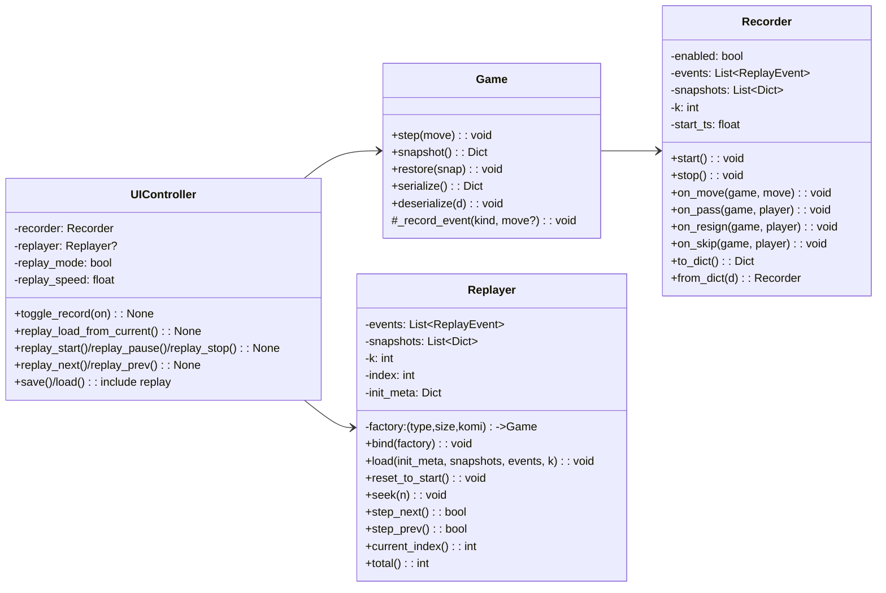

# 棋类对战平台（第二阶段扩展：录像与回放）

本说明在已完成的第一阶段（围棋/五子棋）与第二阶段（黑白棋+AI）基础上，新增“录像与回放”功能，实现行棋过程的记录与存档后回放。

## 1. 目标与范围

- 录像（Record）
  - 支持记录对局过程中每一步的“动作事件”：落子（玩家/AI）、虚着（围棋）、认负、跳过（黑白棋）。
  - 每个事件包含：动作类型、玩家颜色、坐标（可选）、时间戳、结果快照索引。
  - 支持自动开启录像（默认开启）与手动控制。
- 回放（Replay）
  - 在读取存档后可进入回放模式，按序播放事件，支持播放控制：开始/暂停、停止、上一步、下一步、速度调节（0.25x~4x）。
  - 回放时 UI 自动渲染历史状态，底部英文提示与当前手展示保持一致；禁用用户下子与 AI 自动走子。
- 存档与兼容
  - 保存存档时 meta.type 继续规范为 go/gomoku/reversi。
  - data 中新增 replay 段（事件与关键帧）。加载时若存在则使用；否则可由历史记录重建基础回放（降级）。
  - 向后兼容：旧存档无 replay 段时仍可加载与继续对局。

## 2. 架构与设计

### 2.1 模块与职责
- core/replay.py
  - Recorder：对局进行中捕捉事件（on_move/on_pass/on_resign/on_skip），保留事件序列与定期关键帧快照，便于回放时快速定位。
  - Replayer：根据事件流驱动“时间轴”，生成某一帧的 Game 状态（通过 Game.restore/deserialize 应用快照），提供 step_next/step_prev/play/pause/seek。
- core/game.py
  - 在模板方法 Game.step 中插入钩子调用 Recorder 以记录事件；在 serialize/deserialize 中携带 replay 数据。
- ui/controller.py
  - 管理录像开关与 Replayer 实例，提供 UI 控制接口（开始/暂停/停止/上一步/下一步/速度）。
  - 进入回放模式时，冻结对局交互与 AI 循环，仅根据 Replayer 推送状态刷新渲染。
- ui/app_ui.py
  - 新增“录像与回放”控制区：开关、控制按钮、速度选择、时间轴预览（文本/状态图）。
- ui/renderer.py
  - 无需修改（仍渲染棋盘、最后一步标记、底部英文文案）。

### 2.2 设计模式
- 模板方法（Template）：Game.step 统一流程中，在验证合法/快照入栈/应用落子之后，通过钩子通知 Recorder 记录事件，最大限度解耦录像与规则。
- 观察者（Observer）/发布-订阅：UIController 监听 Replayer 的“时间推进”，在播放计时器回调中刷新渲染。
- 策略（Strategy）：不同棋种仍走原有规则策略；录像机制不侵入具体棋规类，依赖统一接口（snapshot/restore/serialize/deserialize）。
- 工厂（Factory）：继续使用 create_game 创建具体棋种，回放时也通过工厂创建空白实例后 restore 指定快照。

### 2.3 面向对象原则
- 单一职责：Recorder 仅负责记录事件，Replayer 仅负责回放时间轴与状态恢复；Game 保持规则与历史一致性；UIController 负责状态编排。
- 开闭原则：新增录像与回放无需修改具体规则实现（围棋/五子棋/黑白棋），仅在 Game 模板插入记录钩子与序列化字段。
- 依赖倒置：UIController 依赖抽象的 Replayer/Recorder 接口与 Game 抽象能力（snapshot/restore）。

## 3. 数据模型与事件

事件定义（核心字段）：
- type: "move" | "pass" | "resign" | "skip"
- player: "BLACK" | "WHITE" | null（skip 仍可记录当前玩家）
- row, col: int?（落子型事件携带）
- ts: float（相对时间秒，从录像开始计）
- snap_index: int（对应的关键帧索引，便于回放快速复原）

关键帧（snapshot）：
- 每隔 K 步（默认 10）存一帧：Game.snapshot() 返回的轻量状态；或也可使用 serialize() 的“数据面板”形态。为保持体积与一致性，本实现使用 snapshot（更小）+ 初始局面（deserialize 时可重建）。

Replay 数据存储在 data.replay：
- {
  "enabled": true,
  "events": [ ... ],
  "snapshots": [ snapshot0, snapshotK, snapshot2K, ... ],
  "k": 10
}

## 4. 关键类与接口

### 4.1 core.replay.Recorder
- start(): 开始计时与清空事件
- stop(): 停止记录
- on_move(move: Move, game: Game): 记录 move 事件，必要时写入关键帧
- on_pass(player), on_resign(player), on_skip(player): 同上
- to_dict()/from_dict(): 序列化/反序列化

### 4.2 core.replay.Replayer
- bind(game_factory): 设置用于创建空游戏实例的工厂闭包 (game_type,size,komi)->Game
- load(initial_state, snapshots, events, k): 初始化回放时间轴
- reset_to_start(): 回到起始局面
- step_next()/step_prev(): 前/后步复原
- seek(n): 跳到第 n 步（用最近关键帧+增量事件重放）
- play(speed): 启动播放（交由 UI 定时器驱动，非阻塞）
- pause()/stop()
- current_index()/total()

### 4.3 序列化与兼容（core.game）
- serialize(): 原有字段基础上新增 "replay" 段（若 recorder.enabled 为 True）
- deserialize(): 恢复棋局时，若数据包含 replay，则 UI 可进入回放模式；若无，则不影响。

## 5. UML（Mermaid）

## 6. 测试用例与结果

- 录制/重放一致性（五子棋）
  - 随机下 12 手，保存存档，清盘后加载存档进入回放模式，1x 播放至末尾，棋面一致；逐步 next/prev 与播放一致。
- 围棋虚着/终局
  - 回合内执行：黑落子、白虚着、黑虚着，终局；回放序列应含 move/pass/pass，最终 score 可计算且与原对局一致（UI 弹窗中文一致）。
- 黑白棋自动跳过/AI
  - 构造局面使当前方无合法着法，记录 skip 事件；启用 AI-AI 自动行棋 20 步后保存；回放时逐步复现相同的子数变化与角点优先；跳过与翻子均正确。
- 速度与控制
  - 0.5x / 2x 播放均可流畅推进；暂停/继续不丢帧；停止后返回起始局面且 replay_mode 仍可保持（用户可重新开始）。
- 兼容性
  - 读取旧存档（无 replay 段）可正常加载并继续下棋；若需要回放，可在 UI 中“从当前对局构建回放”（从历史栈生成简化事件）。

## 7. 使用说明

- 依赖：`pip install gradio==4.* pillow`
- 运行：`python app.py`
- 在右侧“录像与回放”区：
  - 录制：默认开启，亦可手动切换“启用录像”
  - 回放：读档后点击“进入回放模式”，使用“开始/暂停/上一步/下一步/停止/速度”控制
  - 保存：会携带录像数据（events+snapshots），读档时自动识别

## 8. 总结

通过在 Game 模板方法阶段插入记录钩子，并引入 Recorder/Replayer 两个职责单一的类，实现了对所有棋种统一的录像与回放能力，且与已有 AI、自动跳过与 UI 架构解耦。序列化中嵌入 replay 段保证了回放的可移植性与兼容性。