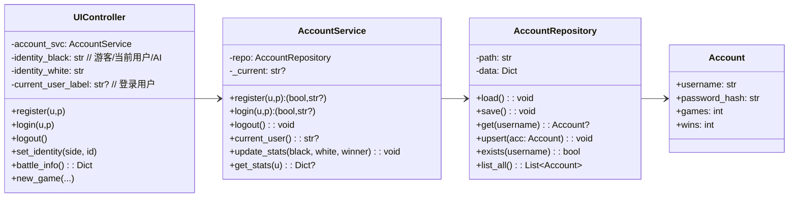

# 棋类对战平台（第二阶段扩展：用户账号管理）

作者：陈骁  
仓库：https://github.com/Cevaaa/go.git  
演示视频：上传至清华网盘并附链接

本说明在已完成的第一阶段（五子棋/围棋）与第二阶段（黑白棋+AI、录像回放）基础上，新增“用户账号管理”能力：登录/注册、战绩统计与展示、对局结束写回胜负、录像关联用户信息。

## 1. 目标与范围

- 账户（Account）
  - 支持注册、登录、登出；密码本地哈希存储（SHA-256），不明文保存。
  - 账户持久化：本地 JSON 文件（默认 accounts.json），记录 username、password_hash、stats（games、wins）。
- 双方身份选择
  - 黑/白双方可选择：游客（未登录）、某个已登录用户（登录后可作为对局方）、AI。
  - 对局过程中在 UI 显示黑白双方的身份（游客/用户名/AI）与各自战绩。
- 战绩更新
  - 对局结束（胜/负/平）后，若黑或白为登录用户，则更新其战绩：games+1；胜者 wins+1，平局双方仅 games+1。
- 录像与存档关联
  - 保存时在 meta 中写入对局双方用户名（若为游客/AI 使用 "guest"/"AI" 标记）；在 data.replay.meta.users 中冗余存储，便于回放时展示。
  - 读取时若包含用户信息则展示，不影响棋局还原。
- UI 扩展
  - 右侧新增“用户账户”折叠区：登录（用户名+密码）、注册、登出、黑白方身份选择（游客/当前用户/AI）、战绩展示、刷新。

## 2. 架构与设计

### 2.1 模块与职责
- core/accounts.py
  - Account：实体（username、password_hash、stats）
  - AccountRepository：基于 JSON 的账户读写，提供增删改查
  - AccountService：封装业务逻辑（注册、登录校验、登出、统计更新）
- ui/controller.py
  - 增加账户相关状态（current_user）、对局双方身份（black_identity / white_identity），新建对局时按身份组装（玩家/AI/游客）。
  - 结束对局时调用 AccountService.update_stats 写回胜负。
  - 保存/读取时携带/展示用户信息；录像 replay.meta.users 写入双方用户名。
- ui/app_ui.py
  - 新增“用户账户”折叠区：登录/注册/登出控件、黑白方身份选择、战绩展示卡片。
- core/replay.py
  - replay 数据增加 meta 字段（users：{"black": "...", "white": "..." }），兼容旧格式。
- core/game.py
  - serialize/deserialize 中在 data.meta.users 字段写入对局双方用户（可选），兼容旧格式。

### 2.2 设计模式
- 仓库模式（Repository）：AccountRepository 抽象持久化细节，业务侧只用 AccountService 接口。
- 门面/服务（Service Facade）：AccountService 对外提供简单方法（register/login/logout/update_stats），隐藏底层读写。
- 模板方法（继续沿用）：Game.step 统一流程；终局处理仍在规则/控制器；控制器在终局后触发账号统计。
- 工厂（继续沿用）：create_game 选择具体棋种，与账户解耦。

### 2.3 面向对象原则
- 单一职责：账户、对局、AI、回放分离；各自模块只做一件事。
- 开闭原则：在不修改棋规与 AI 的前提下扩展账户功能；渲染与 UI 仅新增控件与胶水逻辑。
- 依赖倒置：UIController 依赖抽象的 AccountService 接口行为，不依赖具体 JSON 实现。

## 3. 数据模型

账户库（accounts.json）：
```json
{
  "users": {
    "alice": {"password_hash": "<sha256>", "stats": {"games": 12, "wins": 7}},
    "bob": {"password_hash": "<sha256>", "stats": {"games": 5, "wins": 3}}
  }
}
```

对局存档（节选）：
```json
{
  "meta": {
    "type": "reversi",
    "size": 8,
    "komi": null,
    "users": {"black": "alice", "white": "AI"}   // 可选
  },
  "data": {
    "...": "...",
    "replay": {
      "enabled": true,
      "events": [...],
      "snapshots": [...],
      "k": 10,
      "meta": {"users": {"black": "alice", "white": "AI"}} // 可选冗余
    }
  }
}
```

## 4. 关键类与接口

### 4.1 core.accounts
- Account
  - username: str
  - password_hash: str
  - games: int
  - wins: int
- AccountRepository
  - load(): None
  - save(): None
  - get(username) -> Account | None
  - upsert(account): None
  - exists(username) -> bool
- AccountService
  - register(username, password) -> bool, err
  - login(username, password) -> bool, err
  - logout() -> None
  - current_user() -> Optional[str]
  - update_stats(black_user, white_user, winner) -> None
  - get_stats(username) -> dict | None

### 4.2 UIController（账户相关）
- login(username, password) -> (img, popup)
- register(username, password) -> (img, popup)
- logout() -> (img, popup)
- set_identity(side, identity) -> (img, popup)  // side in {"black","white"}, identity in {"游客","当前用户","AI"}
- battle_info() -> {"black": {"label","stats"}, "white": {...}} 用于 UI 展示
- 新对局 new_game 时将身份配置写入 message 与保存/读取 meta.users；终局后调用 update_stats

## 5. UML（Mermaid）



## 6. 测试用例与结果

- 注册/登录
  - 注册 alice/123456 成功；重复注册返回“用户名已存在”。
  - 登录 alice/123456 成功；错误密码登录失败。
- 身份选择
  - 登录后，将黑方设为“当前用户”，白方设为“AI”，新对局开始时状态栏显示 “Black: alice(7/12) vs White: AI(-/-)”。
- 战绩更新
  - 五子棋测试：alice(黑) 战胜 AI，终局后 accounts.json 中 alice.games 自增 1、alice.wins 自增 1。
  - 平局时，仅双方 games 各+1（若为游客不计入）。
- 存档携带与读取
  - 保存存档 meta.users 正确写入 {"black":"alice","white":"AI"}。
  - 读取后 UI 展示双方身份；若无 users 字段，显示为 “游客/AI”（按当前身份设置）。
- 回放
  - 载入含 replay 的存档后进入回放模式，底部英文提示仍由渲染器生成。回放不触发统计写回。

## 7. 使用说明（补充）

- 配置账户库路径（可选）：默认工作目录 accounts.json。也可在 UIController 初始化时传入路径。
- 密码存储：SHA-256；本地开发用途，不涉及复杂安全策略（如盐、KDF），可在后续扩展。

## 8. 总结

通过 Repository + Service 的账户模块，平台在不侵入棋规/AI/回放的前提下，新增了用户登录、注册与战绩统计，并将对局与录像与用户信息关联，符合“可扩展、低耦合”的设计目标。